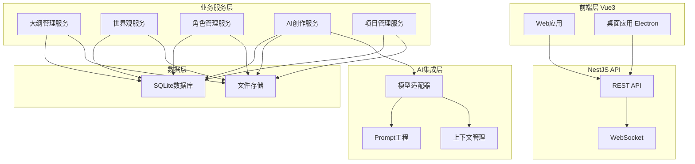
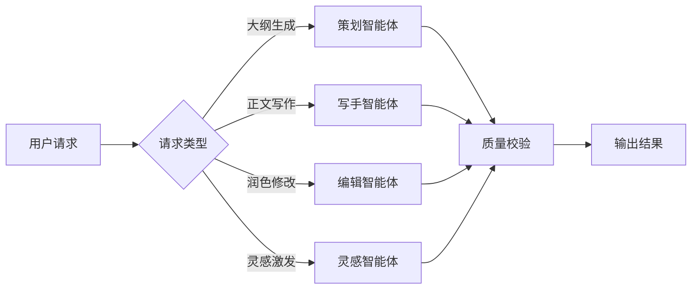
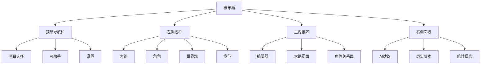
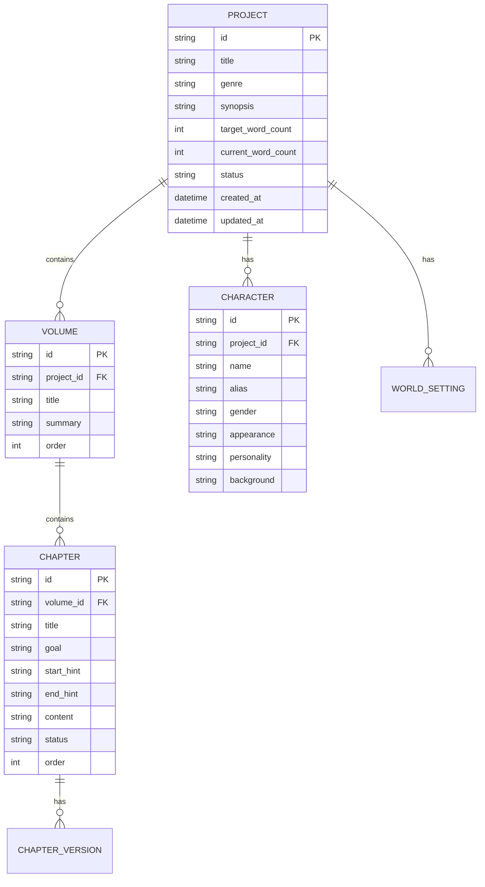

# 小说AI辅助创作系统 V2 设计方案

## 一、项目概述

### 1.1 项目背景

本项目是全新开发的"小说AI辅助创作系统"（以下简称新系统），旨在为网络文学作者提供一站式AI创作辅助平台。新系统将不基于现有 NovelSystem 代码，从零开始构建，以更现代的架构和更优秀的设计理念打造。

### 1.2 核心定位

面向网络文学作者的一站式AI创作平台，包含大纲管理、世界观设定、角色管理、AI写作等核心功能，帮助作者提升创作效率、维护长篇一致性。

### 1.3 目标用户

个人网络文学作者，长篇小说创作者，需要AI辅助创作工具的写手。

---

## 二、技术架构

### 2.1 技术栈选型

| 层级 | 技术选型 | 说明 |
|------|----------|------|
| 前端框架 | Vue 3 + TypeScript | 现代化前端框架，类型安全 |
| 构建工具 | Vite | 快速开发体验 |
| UI组件库 | Element Plus | 成熟的Vue3组件库 |
| 状态管理 | Pinia | Vue3官方推荐状态管理 |
| 后端框架 | NestJS | 渐进式Node.js后端框架 |
| 数据库 | SQLite（本地开发）/ PostgreSQL（生产） | 本地部署优先SQLite |
| ORM | Prisma | 现代化的ORM工具 |
| AI集成 | OpenAI API / Claude API / DeepSeek API | 多模型适配器模式 |

### 2.2 系统架构图



### 2.3 目录结构

```
小说AI辅助创作系统/
├── frontend/                    # 前端应用
│   ├── src/
│   │   ├── api/               # API客户端
│   │   ├── assets/            # 静态资源
│   │   ├── components/        # 公共组件
│   │   ├── composables/       # 组合式API
│   │   ├── layouts/           # 布局组件
│   │   ├── pages/             # 页面组件
│   │   ├── router/            # 路由配置
│   │   ├── stores/            # Pinia状态管理
│   │   ├── types/             # TypeScript类型
│   │   ├── utils/             # 工具函数
│   │   └── App.vue
│   ├── package.json
│   ├── vite.config.ts
│   └── tsconfig.json
│
├── backend/                    # 后端应用
│   ├── src/
│   │   ├── modules/           # NestJS模块
│   │   │   ├── auth/          # 认证模块
│   │   │   ├── project/       # 项目管理模块
│   │   │   ├── outline/       # 大纲管理模块
│   │   │   ├── world/         # 世界观模块
│   │   │   ├── character/     # 角色管理模块
│   │   │   ├── chapter/       # 章节管理模块
│   │   │   ├── ai/            # AI创作模块
│   │   │   └── export/        # 导出模块
│   │   ├── common/            # 公共模块
│   │   ├── config/            # 配置模块
│   │   ├── database/          # 数据库配置
│   │   └── main.ts
│   ├── package.json
│   └── tsconfig.json
│
├── docs/                       # 文档
│   ├── api/                   # API文档
│   ├── design/                # 设计文档
│   └── user/                  # 用户文档
│
└── scripts/                   # 脚本
    ├── dev.sh                 # 开发启动脚本
    ├── build.sh               # 构建脚本
    └── setup.sh               # 安装脚本
```

---

## 三、核心功能模块

### 3.1 项目管理模块

**功能描述**：管理用户的创作项目，支持多项目创建、切换、删除等操作。

**核心功能**：
- 项目创建：创建新小说项目，设置基本信息（书名、题材、简介、目标字数）
- 项目列表：展示所有项目，支持搜索和筛选
- 项目设置：修改项目基本信息
- 项目删除：删除项目（支持回收站）
- 项目导入：导入已有项目数据
- 项目导出：导出项目为指定格式

**数据结构**：

```typescript
interface Project {
  id: string;
  title: string;              // 书名
  genre: string;              // 题材类型
  synopsis: string;           // 简介
  targetWordCount: number;    // 目标字数
  currentWordCount: number;   // 当前字数
  status: ProjectStatus;     // 项目状态
  createdAt: Date;
  updatedAt: Date;
}

enum ProjectStatus {
  DRAFT = 'draft',           // 草稿中
  WRITING = 'writing',       // 创作中
  COMPLETED = 'completed',   // 已完成
  ARCHIVED = 'archived'      // 已归档
}
```

### 3.2 大纲管理模块

**功能描述**：管理小说的结构化大纲，支持卷-章-节多级目录结构。

**核心功能**：
- 大纲创建：创建小说大纲，支持多卷多章结构
- 大纲编辑：可视化拖拽调整章节顺序
- 大纲节点：支持节点标注（高潮、铺垫、转折、伏笔等）
- 大纲扩写：选定大纲节点生成详细正文
- 大纲版本：支持版本历史和回滚

**数据结构**：

```typescript
interface Outline {
  id: string;
  projectId: string;
  volumes: Volume[];
}

interface Volume {
  id: string;
  title: string;              // 卷标题
  summary: string;           // 卷概要
  chapters: Chapter[];
}

interface Chapter {
  id: string;
  title: string;              // 章节标题
  goal: string;               // 章节目标
  startHint: string;          // 开头提示
  endHint: string;           // 结尾提示
  characters: string[];       // 涉及角色ID
  scenes: string[];           // 涉及场景
  tags: ChapterTag[];         // 章节标签
  status: ChapterStatus;     // 章节状态
  content: string;           // 正文内容
}

enum ChapterTag {
  CLIMAX = 'climax',         // 高潮
  SETUP = 'setup',           // 铺垫
  TURN = 'turn',             // 转折
  HOOK = 'hook',             // 伏笔
  FIGHT = 'fight',           // 战斗
  EMOTION = 'emotion',       // 情感
}

enum ChapterStatus {
  OUTLINE = 'outline',        // 大纲
  DRAFT = 'draft',           // 草稿
  REFINING = 'refining',      // 精修
  COMPLETED = 'completed',   // 完成
}
```

### 3.3 世界观设定模块

**功能描述**：管理小说的世界观设定，包括力量体系、地理地图、种族文明、时间线等。

**核心功能**：
- 设定集管理：力量体系、地理地图、种族文明、时间线
- 动态更新：自动检测并建议更新设定库
- 一致性校验：生成前扫描前文确保不冲突
- 设定查询：快速查找设定细节

**数据结构**：

```typescript
interface WorldSetting {
  id: string;
  projectId: string;
  categories: WorldCategory[];
}

interface WorldCategory {
  id: string;
  name: string;              // 分类名称
  type: WorldCategoryType;   // 分类类型
  entries: WorldEntry[];
}

enum WorldCategoryType {
  POWER_SYSTEM = 'power_system',   // 力量体系
  GEOGRAPHY = 'geography',          // 地理地图
  RACE = 'race',                  // 种族文明
  TIMELINE = 'timeline',          // 时间线
  FACTION = 'faction',            // 势力
  ITEM = 'item',                  // 物品
  CULTURE = 'culture',            // 文化
}

interface WorldEntry {
  id: string;
  name: string;              // 名称
  description: string;       // 描述
  relationships: string[];   // 关联条目
  metadata: Record<string, any>;
}
```

### 3.4 角色管理模块

**功能描述**：管理小说中的角色信息，包括静态属性和动态属性。

**核心功能**：
- 角色卡片：包含基本信息、性格特点、背景故事、能力技能
- 关系图谱：可视化展示角色间关系
- 视角切换：选定角色续写故事片段
- 角色成长：记录角色成长轨迹

**数据结构**：

```typescript
interface Character {
  id: string;
  projectId: string;
  name: string;              // 姓名
  alias: string[];           // 别名
  gender: string;            // 性别
  age: string;               // 年龄
  appearance: string;        // 外观描述
  personality: string;      // 性格特点
  background: string;        // 背景故事
  abilities: string[];       // 能力技能
  relationships: CharacterRelationship[];
  appearances: string[];     // 出场章节
  status: CharacterStatus;
}

interface CharacterRelationship {
  characterId: string;
  type: RelationshipType;
  description: string;
}

enum RelationshipType {
  FAMILY = 'family',         // 家族
  FRIEND = 'friend',          // 朋友
  ENEMY = 'enemy',            // 敌人
  LOVE = 'love',              // 恋人
  MENTOR = 'mentor',          // 导师
  RIVAL = 'rival',            // 对手
}

enum CharacterStatus {
  PLANNED = 'planned',        // 计划中
  ACTIVE = 'active',           // 活跃中
  COMPLETED = 'completed',     // 已完成
  DEAD = 'dead',              // 已故
}
```

### 3.5 AI创作模块

**功能描述**：提供AI智能创作能力，包括大纲生成、正文写作、润色修改等。

**核心功能**：
- 大纲生成：根据题材和设定生成故事大纲
- 正文写作：根据大纲和设定生成正文
- 润色修改：AI润色、查重、检测AI味
- 灵感激发：提供创作灵感和素材
- 多模型支持：支持OpenAI、Claude、DeepSeek等模型

**AI智能体架构**：



**Prompt工程设计**：

```typescript
interface PromptTemplate {
  id: string;
  name: string;
  type: PromptType;
  template: string;
  variables: PromptVariable[];
}

enum PromptType {
  OUTLINE_GENERATE = 'outline_generate',
  CHAPTER_WRITE = 'chapter_write',
  CHAPTER_POLISH = 'chapter_polish',
  CHARACTER_GENERATE = 'character_generate',
  WORLD_GENERATE = 'world_generate',
  INSPIRATION = 'inspiration',
}
```

### 3.6 导出模块

**功能描述**：支持多种格式导出，方便作者发布和分享。

**核心功能**：
- 导出格式：TXT、EPUB、PDF、DOCX
- 批量导出：支持整书或分卷导出
- 自定义模板：支持导出模板定制

---

## 四、用户界面设计

### 4.1 整体布局



### 4.2 核心页面

| 页面 | 功能 | 描述 |
|------|------|------|
| 项目列表页 | 项目管理 | 展示所有项目，支持创建、切换、删除 |
| 大纲编辑页 | 大纲管理 | 可视化编辑小说大纲，支持拖拽调整 |
| 章节编辑页 | 章节创作 | 章节正文编辑，支持AI辅助 |
| 角色管理页 | 角色管理 | 角色卡片管理，关系图谱展示 |
| 世界观页 | 世界观管理 | 设定集管理，一致性校验 |
| AI助手页 | AI创作 | AI创作辅助，灵感激发 |

### 4.3 交互设计

- **斜杠命令**：在编辑器中输入"/"触发快捷操作
- **划词功能**：选中文字提供修改建议
- **智能提示**：根据上下文提供AI建议
- **实时保存**：自动保存创作内容

---

## 五、数据存储设计

### 5.1 数据库设计

**SQLite数据库表结构**：



### 5.2 文件存储

- **项目数据**：存储在 `~/NovelAI/projects/{projectId}/` 目录
- **导出文件**：存储在 `~/NovelAI/exports/` 目录
- **配置文件**：存储在 `~/NovelAI/config.json`

---

## 六、部署方案

### 6.1 本地部署

**前置要求**：
- Node.js 18+
- npm 或 yarn

**安装步骤**：

```bash
# 1. 克隆项目
git clone <repository-url> novel-ai-v2
cd novel-ai-v2

# 2. 安装后端依赖
cd backend
npm install

# 3. 安装前端依赖
cd ../frontend
npm install

# 4. 初始化数据库
cd ../backend
npm run prisma:generate
npm run prisma:migrate

# 5. 启动开发服务器
# 终端1：启动后端
npm run start:dev

# 终端2：启动前端
cd ../frontend
npm run dev
```

### 6.2 配置说明

**环境变量配置**：

```env
# 后端配置
DATABASE_URL=file:./dev.db
AI_API_KEY=your-api-key
AI_MODEL=deepseek-chat

# 前端配置
VITE_API_URL=http://localhost:3000
```

---

## 七、开发计划

### 7.1 阶段划分

| 阶段 | 里程碑 | 周期 | 主要任务 |
|------|--------|------|---------|
| Phase 1 | 基础框架 | 2周 | 项目搭建、数据库设计、基础CRUD |
| Phase 2 | 核心功能 | 4周 | 大纲管理、角色管理、世界观 |
| Phase 3 | AI集成 | 3周 | AI创作模块、Prompt工程 |
| Phase 4 | 完善优化 | 2周 | 导出功能、UI优化、测试 |
| Phase 5 | 发布准备 | 1周 | 文档、部署脚本、发布 |

### 7.2 优先级定义

**P0（必须实现）**：
- 项目管理（CRUD）
- 大纲管理（CRUD）
- 章节管理（CRUD）
- 基础AI写作

**P1（重要功能）**：
- 角色管理
- 世界观管理
- AI润色修改
- 导出功能

**P2（增强功能）**：
- 关系图谱
- 一致性校验
- 版本历史
- 统计看板

---

## 八、风险与挑战

### 8.1 技术风险

| 风险 | 影响 | 缓解措施 |
|------|------|----------|
| AI模型响应不稳定 | 创作质量波动 | 多模型切换、失败重试 |
| 长文本处理 | 上下文丢失 | 分段处理、向量存储 |
| 数据库性能 | 操作卡顿 | 索引优化、缓存 |

### 8.2 产品风险

| 风险 | 影响 | 缓解措施 |
|------|------|----------|
| 用户学习成本 | 使用门槛高 | 引导教程、示例 |
| 功能复杂度 | 开发周期长 | 敏捷迭代、MVP优先 |

---

## 九、附录

### 9.1 参考资料

- [Vue 3 文档](https://vuejs.org/)
- [NestJS 文档](https://docs.nestjs.com/)
- [Prisma 文档](https://www.prisma.io/docs/)
- [Element Plus](https://element-plus.org/)

### 9.2 术语表

| 术语 | 说明 |
|------|------|
| 大纲 | 小说的结构化目录，包含卷-章-节 |
| 世界观 | 小说设定的集合，包括力量体系、地理等 |
| 角色 | 小说中的人物及其属性 |
| 章节 | 小说的基本创作单元 |
| AI智能体 | 负责特定AI任务的程序模块 |

---

**文档版本**：V1.0  
**创建日期**：2026-04-23  
**最后更新**：2026-04-23